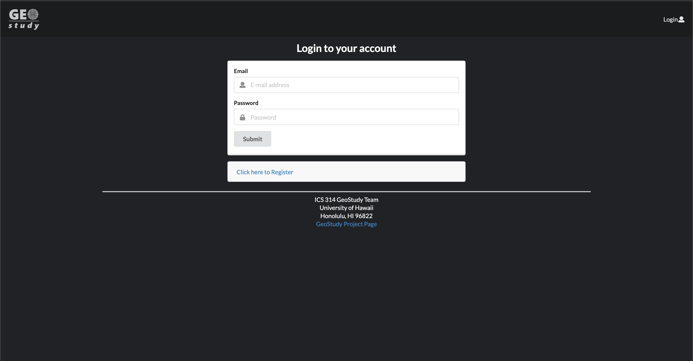
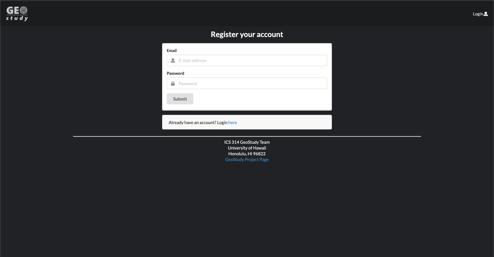
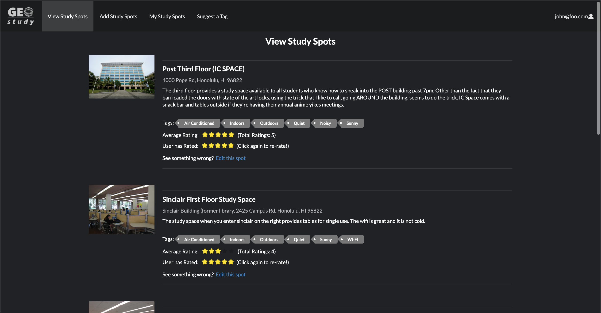
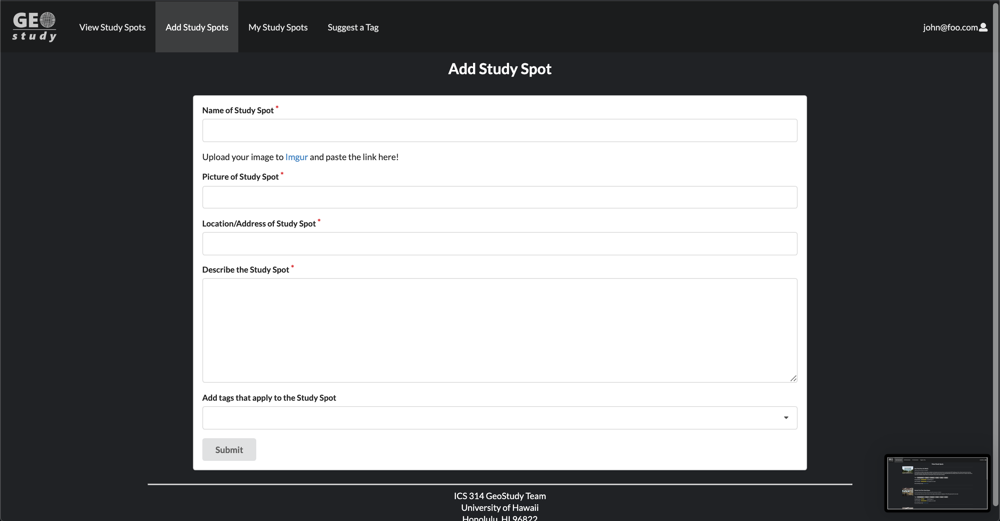
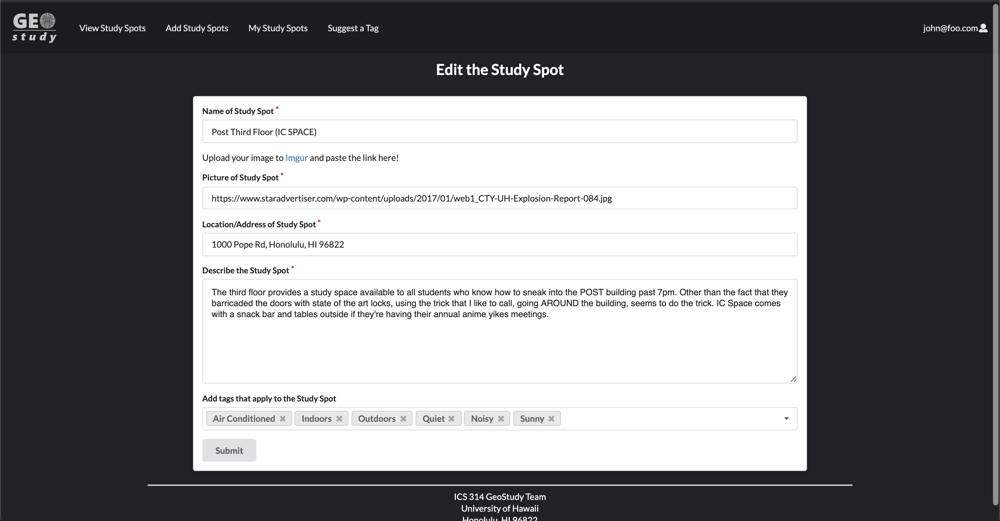
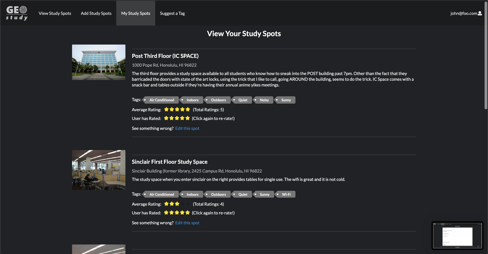
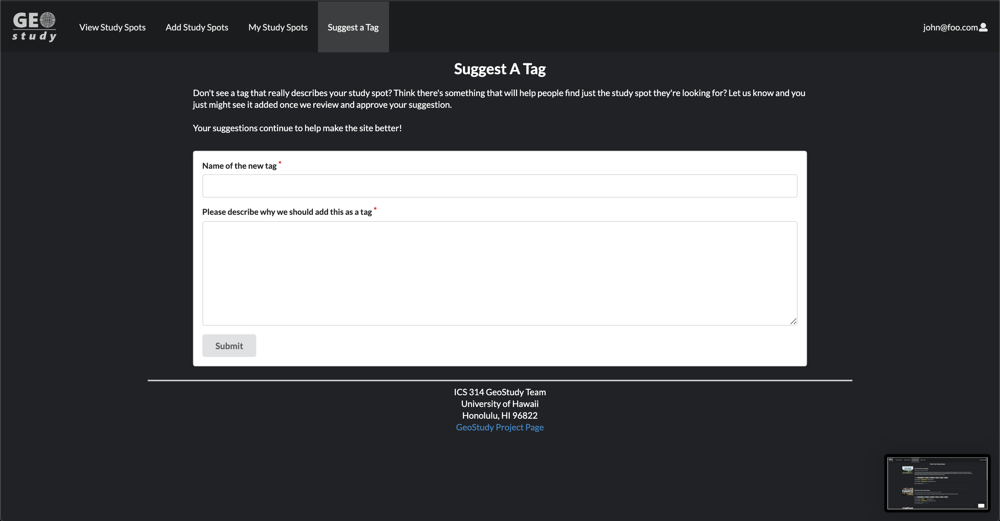

## Table of Contents

* [Team GEOstudy](#team-geostudy)
* [Application](#application)
* [Goals](#goals)
* [Overview](#overview)
* [User Guide](#user-guide)
* [Developer Guide](#developer-guide)

## Team GEOstudy
* [In Woo Park](https://inwoocs.github.io/)
* [Michael Chun](https://mhkfchun.github.io/)
* [Sean Dunston](https://sean-dunston.github.io/)
* [Newton Rasner](https://newtonics.github.io/)

## Application
* [Organization Page](https://github.com/geostudy/)
* [Running Application](http://geostudymhc3.meteorapp.com/#/)
* [Milestone 1](https://github.com/geostudy/geostudy-source/projects/2)
* [Milestone 2](https://github.com/geostudy/geostudy-source/projects/3)
* [Milestone 3](https://github.com/geostudy/geostudy-source/projects/4)

## Goals
* Learn practical applications of coding.
* Coding a project as a team.
* Designing a website with Meteor/React.
* Effectively using GitHub to manage the workload.
* Implementing our knowledge from the class/past classes.

## Overview
Students spend a lot of time studying and working on class assignments on school campus. The places that they choose to work can make the difference between getting things done or wasting your time. Not to mention the size of the campus with so many options to choose from.

That's where GEOstudy comes in. GEOstudy will be a resource for people to post some of their favorite places to study and get their work done. Whether it's the library or a nice spot in the shade, people can help others find the perfect spot for their needs.

Users can submit locations that others will be able to see.  Based on their experience, users can then rate the location so others will be able to see how other's experiences went.

-Based on the proposal by Christian Jensen-

## User Guide
Users will be able to register an account and log in. They will then be able to add spots (study locations) and view other spots by other users. They can edit their own input spots, but only view other's spots.

Admins will be able to view and edit all user's spots as well as delete them once logged in.

### Step By Step
The **Landing page** is the starting page for new users, which allows them to create an account or login if they are a returning user. The page provides a summary of our mission statement and the services we provide.

[View Page](http://geostudymhc3.meteorapp.com/#/)

##
The **Login Page** allows returning users to login.

[View Page](http://geostudymhc3.meteorapp.com/#/signin)

##
The **Registration Page** allows new users to create an account.

[View Page](http://geostudymhc3.meteorapp.com/#/signup)

##
The **View Spots Page** provides users with the various spots located around the UH Campus and surrounding area. This also shows users the current ratings of each spot and how many ratings it has in parenthesis. If a user owns the spot, they will be able to reach the editing page to edit their spot. Admins are able to see the delete button that removes the spot from the page. *Adding new Ratings to be added*

[View Page](http://geostudymhc3.meteorapp.com/#/spots)

##
The **Add Spot Page** asks users for the name, image, location, and description of the study spot they would like to add. The Add Spot page also supports a tags collection where users can attach tags to the spots (i.e. AC, Indoors, Sunny)

[View Page](http://geostudymhc3.meteorapp.com/#/add)

##
The **Edit Spot page** asks users for the name, image, location, and description of the study spot they would like to edit. Users can also edit the tags that are associated with the spot they are editing.

[View Page](http://geostudymhc3.meteorapp.com/#/edit/wa4MQepauMrPj2ZXx)

##
The **My Study Spots Page** shows the current logged-in users, spots, they have contributed to our site. They also have the ability to enter the edit spots page from this tab. 

[View Page](http://geostudymhc3.meteorapp.com/#/mine)

##
The **Suggest A Tag Page** allows users to suggest a tag they would like the site to have. These suggestions will be saved so admins can filter through the suggestions an officialize appropriate tags.

[View Page](http://geostudymhc3.meteorapp.com/#/suggestion)

## Developer Guide
This section provides information of interest to Meteor developers wishing to use this code base as a basis for their own development tasks.

### Tutorial Video for Developer Guide
If you need a guide to help you, reference this [tutorial video](https://www.youtube.com/watch?v=gt7z-BA0OW4&feature=youtu.be).

### Installation

First, install [Meteor](https://www.meteor.com/install)

Second, visit the [Geostudy Application Github Page](https://github.com/geostudy/geostudy-source), and click the “Use this template” button to create your own repository initialized with a copy of this application. Alternatively, you can download the sources as a zip file or make a fork of the repo. However you do it, download a copy of the repo to your local computer.

Third, cd into the geostudy-source/app direction and install libraries with:

```
$ meteor npm install
```

Fourth, install the Google maps react library with:

```
$ npm install --save react-google-maps
```

Fifth, run the system with:

```
$ meteor npm run start
```
If all goes well, the application will appear at [https://localhost:3000](https://localhost:3000).

### Application Design

Geostudy is based upon [meteor-application-template-react](https://ics-software-engineering.github.io/meteor-application-template-react/) and [meteor-example-form-react](https://ics-software-engineering.github.io/meteor-example-form-react/). Please use the videos and documentation at those sites to better acquaint yourself with the basic application design and form processing in Geostudy.

### Initilization

The [config](https://github.com/geostudy/geostudy-source/tree/master/config) directory is intended to hold settings files. The repository contains one file: [config/settings.development.json](https://github.com/geostudy/geostudy-source/tree/master/config).

This file contains default definitions for default accounts and default profiles.

The [app/private](https://github.com/geostudy/geostudy-source/tree/master/app/private) directory is intended to hold settings files. The repository contains one file: [app/private/data.json](https://github.com/geostudy/geostudy-source/blob/master/app/private/data.json).

This file contains default definitions for spots, tags, and ratings.

The settings.development.json file contains a field called “loadAssetsFile”. It is set to true, but if you change it to false, then the data in the file app/private/data.json will not load. The code to do this illustrates how to initialize a system when the initial data exceeds the size limitations for the settings file.

### Quality Assurance

#### ESLint

Geostudy includes a [.eslintrc](https://github.com/geostudy/geostudy-source/blob/master/app/.eslintrc) file to define the coding style adhered to in this application. You can invoke ESlint from the command line as follows:

```
meteor npm run lint
```

ESlint should run without generating any errors.
It's significantly easier to do development with ESLint integrated directly into your IDE (i.e. Intellij)
