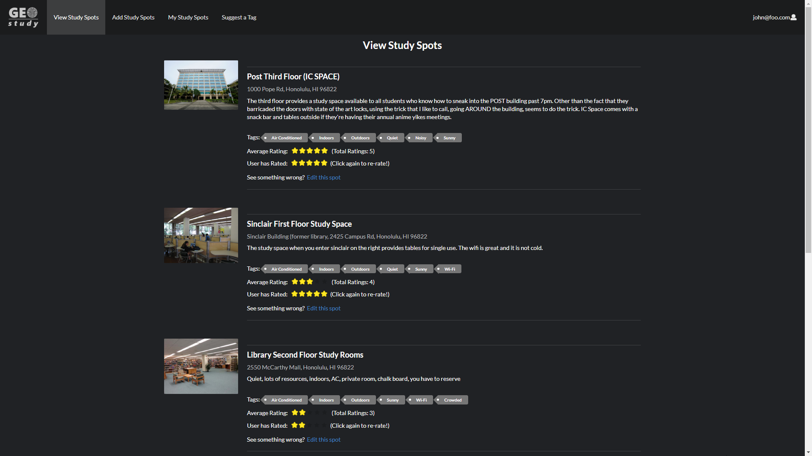

## Table of Contents

* [Team GEOstudy](#team-geostudy)
* [Application](#application)
* [Goals](#goals)
* [Overview](#overview)
* [User Guide](#user-guide)
* [Developer Guide](#developer-guide)

## Team GEOstudy
* [In Woo Park](https://inwoocs.github.io/)
* [Michael Chun](https://mhkfchun.github.io/)
* [Sean Dunston](https://sean-dunston.github.io/)
* [Newton Rasner](https://newtonics.github.io/)

## Application
* [Organization Page](https://github.com/geostudy/)
* [Milestone 1](https://github.com/geostudy/geostudy-source/projects/2)
* [Milestone 2](https://github.com/geostudy/geostudy-source/projects/3)
* [Milestone 3](https://github.com/geostudy/geostudy-source/projects/4)

## Goals
* Learn practical applications of coding.
* Coding a project as a team.
* Designing a website with Meteor/React.
* Effectively using GitHub to manage the workload.
* Implementing our knowledge from the class/past classes.

## Overview
Students spend a lot of time studying and working on class assignments on school campus. The places that they choose to work can make the difference between getting things done or wasting your time. Not to mention the size of the campus with so many options to choose from.

That's where GEOstudy comes in. GEOstudy will be a resource for people to post some of their favorite places to study and get their work done. Whether it's the library or a nice spot in the shade, people can help others find the perfect spot for their needs.

Users can submit locations that others will be able to see.  Based on their experience, users can then rate the location so others will be able to see how other's experiences went.

-Based on the proposal by Christian Jensen-

## User Guide
Users will be able to register an account and log in. They will then be able to add Study Spots (study locations) and view other Study Spots by other users

They can edit their own Study Spots, but only view other's Study Spots.  Users will also be able to see the rating, how many people have given a rating, and give their own rating or adjust their existing rating for each Study Spot.

Users can also suggest tags that they believe will be appropriate for our site.

Using the My Study Spots page, they will also have a place where they can see their owned Study Spots and edit them in one place.

Admins will be able to view and edit all user's spots, see the owners, as well as delete them once logged in.

They also have access to admin exclusive pages. One that allows them to view Suggestions where they can reject or add them as tags. The other allows them to view Tags and edit their names or remove them.

### Landing

The Landing Page is the starting page for new users, which allows them to create an account or login if they are a returning user. The page provides a summary of our mission statement and the services we provide. Once logged in, users will be able to access the rest of the pages.


### Login

The Login Page allows returning users to login.


### Registration

The Registration Page allows new users to create an account.


### User Home

The User's Home Page which removes the login and register buttons and opens up the navigation bar items.


### View Study Spots

The View Study Spots Page provides users with the various spots located around the UH Campus and surrounding area. This also shows users the current ratings of each spot that will update in real time and how many ratings it has total in parenthesis. You are able to click on the ratings below and create a rating for that Study Spot if you have not given it a rating. Otherwise, rating it will re-rate the Study Spot.

If a user owns the spot, they will be able to use the edit link to edit their spot.


### Add Study Spot

The Add Study Spot Page asks users for the name, image, location, and description of the study spot they would like to add. The Add Spot page also supports a tags collection where users can attach tags to the spots. (i.e. Air Conditioned, Indoors, Sunny)

The page prevents the creation of a Study Spot with the same name as an already existing one.


### Edit Study Spot

The Edit Spot Page asks users for the name, image, location, and description of the study spot they would like to edit. Users can also edit the tags that are associated with the spot they are editing.

This page prevents the changing of the name of the Study Spot to one that already exists, unless it is the same name.


### My Study Spots

The My Study Spots Page shows the current logged-in users Study Spots they have contributed to our site. They also have the ability to enter the edit spots page from this tab as well as add/adjust ratings.


### Suggest A Tag

The Suggest A Tag Page allows users to suggest a tag they would like the site to have. These suggestions will be saved so admins can filter through the suggestions and add or reject them.

This page prevents the suggestion of tags that already exist or suggestions that have already been suggested.


### Administrator Home

The Administrator Home Page is similar to the User Home Page, but allows access to admin items in the navigation bar.


### Administrator Suggestions

The Administrator Suggestions Page gives admins access to the suggested tags and allows them to add or reject them. If rejected it will remove the suggestion. If added, it will be added as a usable tag for any Study Spots in the future.


### Administrator Tags

The Administrator Tags Page gives admins access to the currently available tags. From here they can edit or delete existing tags.

This page prevents tags from being edited to itself or to already existing tag names.


### View Study Spots (Admin View)

The same as View Study Spots Page, but when logged in as an admin, shows the owner of the Study Spot as well as allows access to the delete button which will delete the current Study Spot and any ratings associated with it. It will also remove the Study Spot from being associated with any Tags as well.


### My Study Spots (Admin View)

The same as My Study Spots Page, but when logged in as an admin allows access to the delete button which will delete the current Study Spot and any ratings associated with it. It will also remove the Study Spot from being associated with any Tags as well.


## Community Feedback

Overall, what we looked for while testing our site was the presentation, intuitiveness of the site, and its functionality.

Our findings showed the majority were able to understand the site's interface as well as navigate to the different site locations. Though there were some issues with what certain things meant, for example "Spots", we were able to clarify this some by changing "Spots" to "Study Spots" which gives a more clear idea what it is initially.

There were a few design complications such as clickable tags (Which has been fixed) and having an initial rating of 1 (When being allowed to rate a new spot) being confusing and making them think they were already rated. This was fixed to leave it as blank by default also.

The design of the site was mostly well received though a few suggested a different color scheme such as UH related greens and whites. As per a suggestion, a logo was created to replace the existing text in the navigation bar.

The site functionality was mostly well received with a few hiccups that have been ironed out. The redirection to a page after finishing Adding or Editing a Study Spot successfully has been fixed.

The one thing people had suggested, but was not able to implement due to time constraints was the inclusion of a filter and sorting system for tags, ratings, and names.

While the interface to implement this had been created, we were unable to finish the full implementation of it in time.

## Developer Guide
This section provides information of interest to Meteor developers wishing to use this code base as a basis for their own development tasks.

### Tutorial Video for Developer Guide
If you need a guide to help you, reference this [tutorial video](https://youtu.be/yPrlLRYZJ70).

### Installation

First, install [Meteor](https://www.meteor.com/install)

Second, visit the [Geostudy Application Github Page](https://github.com/geostudy/geostudy-source), and click the “Use this template” button to create your own repository initialized with a copy of this application. Alternatively, you can download the sources as a zip file or make a fork of the repo. However you do it, download a copy of the repo to your local computer.

Third, cd into the geostudy-source/app direction and install libraries with:

```
$ meteor npm install
```

Lastly, run the system with:

```
$ meteor npm run start
```
If all goes well, the application will appear at [https://localhost:3000](https://localhost:3000).

### Application Design

Geostudy is based upon [meteor-application-template-react](https://ics-software-engineering.github.io/meteor-application-template-react/) and [meteor-example-form-react](https://ics-software-engineering.github.io/meteor-example-form-react/). Please use the videos and documentation at those sites to better acquaint yourself with the basic application design and form processing in Geostudy.

### Initilization

The [config](https://github.com/geostudy/geostudy-source/tree/master/config) directory is intended to hold settings files. The repository contains one file: [config/settings.development.json](https://github.com/geostudy/geostudy-source/tree/master/config).

This file contains default definitions for default accounts and default profiles.

The [app/private](https://github.com/geostudy/geostudy-source/tree/master/app/private) directory is intended to hold settings files. The repository contains one file: [app/private/data.json](https://github.com/geostudy/geostudy-source/blob/master/app/private/data.json).

This file contains default definitions for spots, tags, and ratings.

The settings.development.json file contains a field called “loadAssetsFile”. It is set to false, but if you change it to true, then the data in the file app/private/data.json will be loaded. The code to do this illustrates how to initialize a system when the initial data exceeds the size limitations for the settings file. Set this to true if you wish to initialize any extra Users, Study Spots, or Tags for example purposes.

### Quality Assurance

#### ESLint

Geostudy includes a [.eslintrc](https://github.com/geostudy/geostudy-source/blob/master/app/.eslintrc) file to define the coding style adhered to in this application. You can invoke ESlint from the command line as follows:

```
meteor npm run lint
```

ESlint should run without generating any errors.
It's significantly easier to do development with ESLint integrated directly into your IDE (i.e. Intellij)
