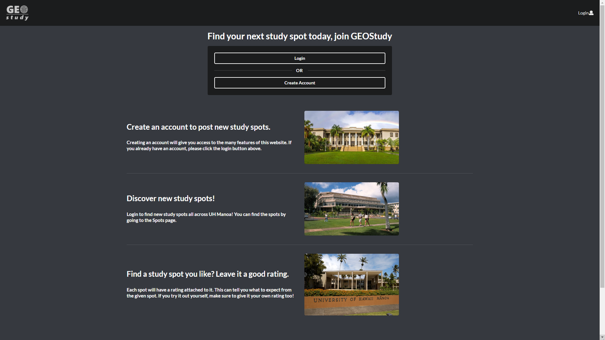

## Table of Contents 

* [Overview](#overview)
* [Case Ideas](#case-ideas)
* [Services](#services)
* [Mockup](#mockup)
* [Team](#team)
* [Goals](#goals)
* [Links](#links)

## Overview
Our Final Project will be based on the Author: Christian Jensen.

"The problem: Most students spend their time studying and doing class assignments. But where we do these things can greatly affect our workflow and productivity. Noise, environment and many other factors can be the deciding factors that allow students to do their work efficiently and effectively.

The solution: Welcome to Study Spot, a place where students can go to find locations that match their studying needs. Users can post places that can be used for studying, a quick break or a place to collaborate with peers. Students can geo pin the locations and give a brief description of their spots. Ratings can be given to these spots so users know where the best spots are."

## Case Ideas 
"Users will first fall on the landing page which will explain how the service works, and how to get started. They can choose if they want to browse existing spots or make a user get more utilities. Then the user makes an account on the new user page, which can have various customizations. Then they can post a spot.
Moderators will fall on the landing page and once logged in will be given access to a hidden page where they can choose to flag or remove posts.
Admin will fall on the landing page and once logged in will be given complete access to the site."

## Services
Students can provide the best study spots on campus in terms of traffic and noise level. Just submit a ticket with a geo pin. Other students can read these suggestions and rate the spots so there's credibility. The admin would probably have to filter through some of the submissions just in case there are repeatitive submissions. 

## Mockup
* **Landing page**

* **Login Page**

* **Registration Page**

* **Map page**

* **Spots page**

* **Add Spots page**

## Team
* In Woo Park
* Michael Chun
* Sean Dunston
* Newton Rasner

## Goals
* Learn practical applications of coding.
* Coding a project as a team.
* Designing a website with Meteor/React.
* Effectively using GitHub to manage the workload.
* Implementing our knowledge from the class/past classes.

## Links
* [Milestone 1](https://github.com/geostudy/geostudy-source/projects/2)
* [Milestone 2](https://github.com/geostudy/geostudy-source/projects/3)
