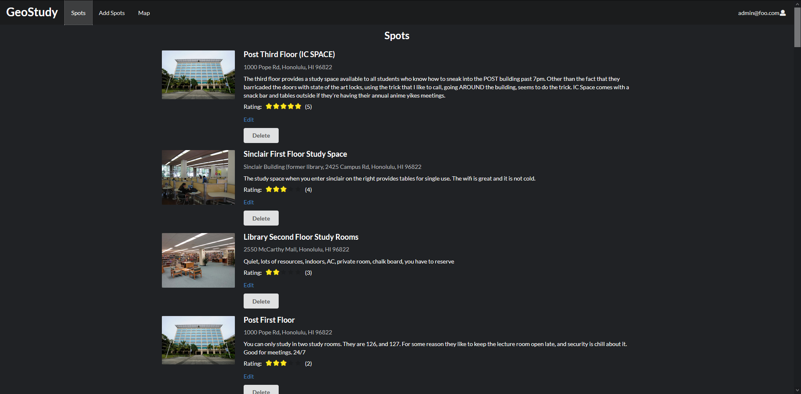

## Table of Contents 

* [Team GEOstudy](#team-geostudy)
* [Application](#application)
* [Goals](#goals)
* [Overview](#overview)
* [User Implemenation](#user-implementation)
* [Mockup](#mockup)

## Team GEOstudy
* In Woo Park
* Michael Chun
* Sean Dunston
* Newton Rasner

## Application
* [Organization Page](https://github.com/geostudy/)
* [Running Application](http://geostudymhc3.meteorapp.com/#/)
* [Milestone 1](https://github.com/geostudy/geostudy-source/projects/2)
* [Milestone 2](https://github.com/geostudy/geostudy-source/projects/3)

## Goals
* Learn practical applications of coding.
* Coding a project as a team.
* Designing a website with Meteor/React.
* Effectively using GitHub to manage the workload.
* Implementing our knowledge from the class/past classes.

## Overview
Students spend a lot of time studying and working on class assignments on school campus. The places that they choose to work can make the difference between getting things done or wasting your time. Not to mention the size of the campus with so many options to choose from.

That's where GEOstudy comes in. GEOstudy will be a resource for people to post some of their favorite places to study and get their work done. Whether it's the library or a nice spot in the shade, people can help others find the perfect spot for their needs.

Users can submit locations that others will be able to see.  Based on their experience, users can then rate the location so others will be able to see how other's experiences went.

-Based on the proposal by Christian Jensen-

## User Implementation
Users will be able to register an account and log in. They will then be able to add spots (study locations) and view other spots by other users. They can edit their own input spots, but only view other's spots.

Admins will be able to view and edit all user's spots as well as delete them once logged in.

## Mockup
* **Landing page**

[View Page](http://geostudymhc3.meteorapp.com/#/)

* **Login Page**

[View Page](http://geostudymhc3.meteorapp.com/#/signin)

* **Registration Page**

[View Page](http://geostudymhc3.meteorapp.com/#/signup)

* **Map page**

[View Page](http://geostudymhc3.meteorapp.com/#/map)

* **Spots page**

[View Page](http://geostudymhc3.meteorapp.com/#/spots)

* **Add Spot page**

[View Page](http://geostudymhc3.meteorapp.com/#/add)

* **Edit Spot page**

[View Page](http://geostudymhc3.meteorapp.com/#/edit)
